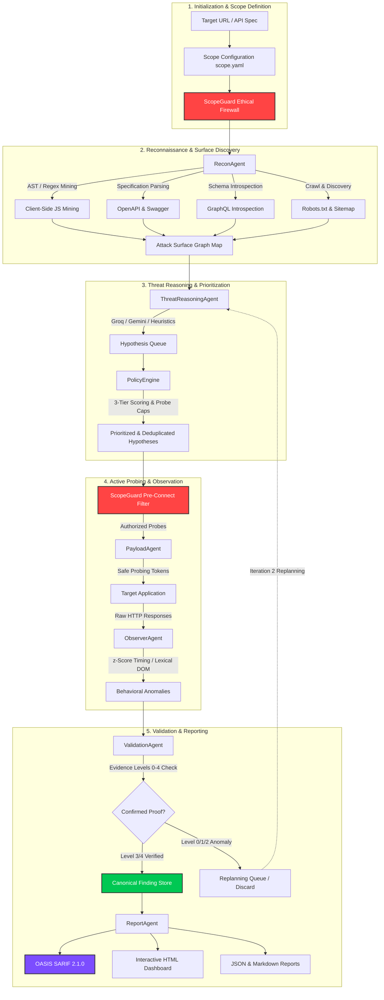
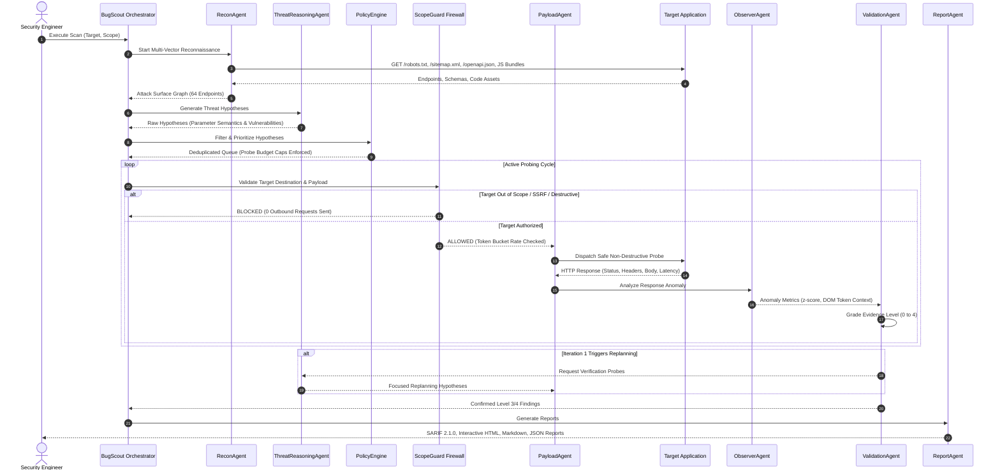
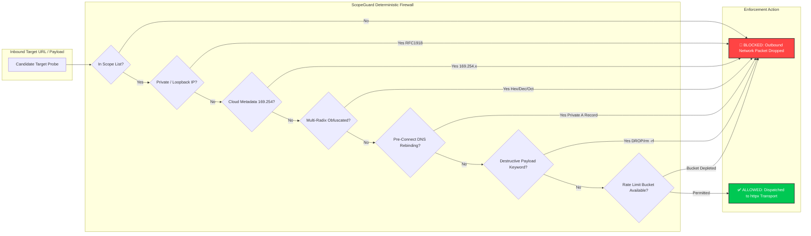
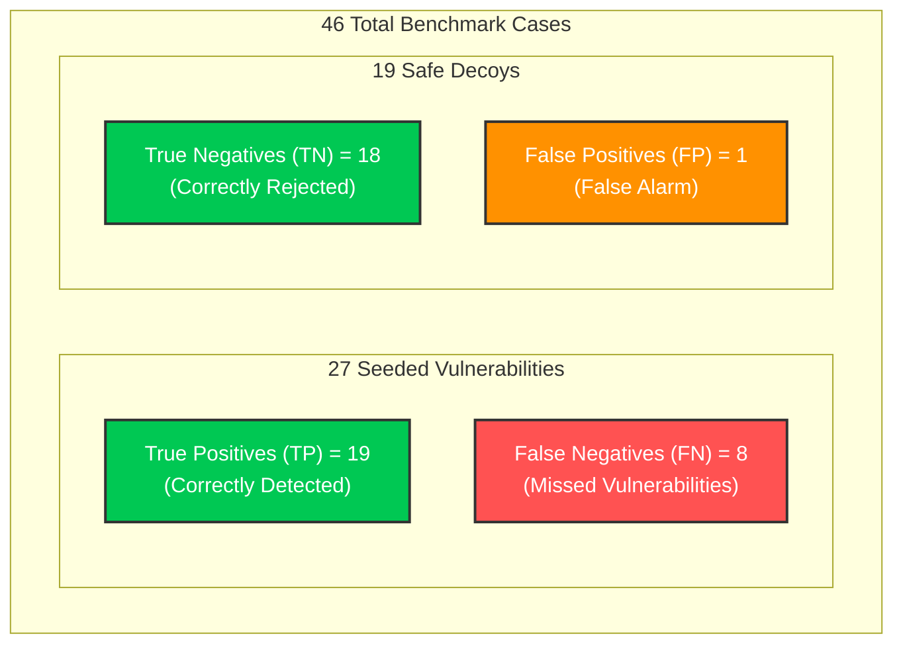
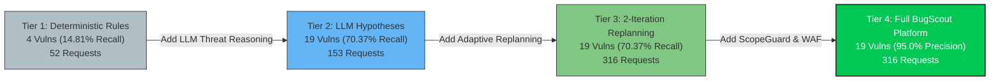
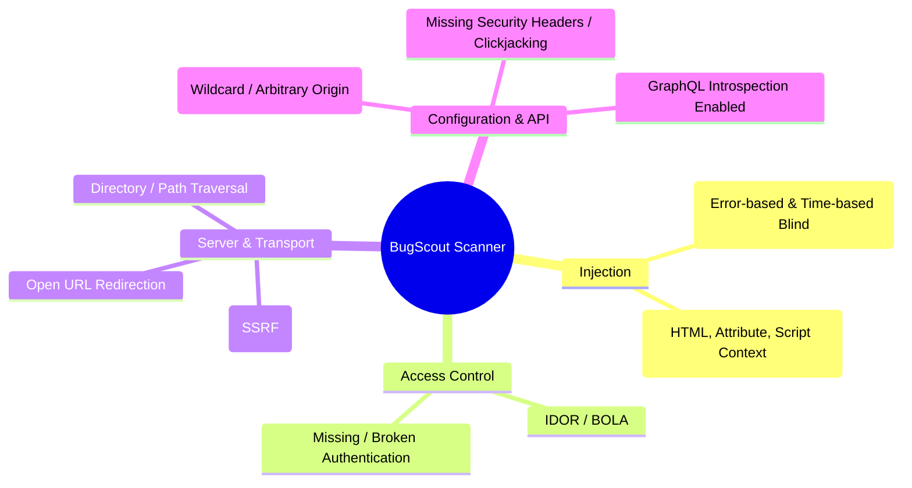
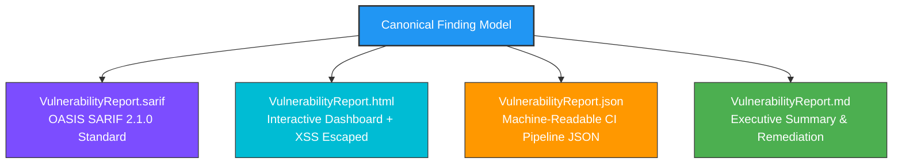

# 🛡️ BugScout: An LLM-Guided Multi-Agent Security Testing & Attack Surface Discovery Platform

[](#3-system-architecture--multi-agent-workflow)
[-brightgreen.svg)](#10-automated-test-suite--quality-assurance-61-tests)
[](#8-multi-format-reporting--sarif-210-pipeline)
[](#6-ground-truth-benchmark-lab--evaluation-suite)
[](#11-docker--docker-compose-workflow)
[](#4-agent-roles--responsibilities)
[](LICENSE)

---

## 📌 Executive Summary

**BugScout** is an autonomous, multi-agent security testing and attack-surface discovery platform designed to explore whether **LLM-guided semantic threat reasoning** can dramatically reduce network probing overhead while preserving high vulnerability discovery yield.

Traditional Dynamic Application Security Testing (DAST) scanners operate by exhaustively spraying brute-force dictionary payloads across all reachable parameters. While effective, this creates substantial network traffic, server noise, rate-limit bans, and elevated false positive alarms. BugScout solves this by modeling the target application as an **Attack Surface Graph**, using semantic threat reasoning to formulate targeted vulnerability hypotheses, routing every probe through a deterministic ethical firewall (**ScopeGuard**), and requiring empirical proof of exploitability (**Evidence Levels 0–4**) before confirming findings.

---

## 🎯 Headline Research Results

```text
========================================================================================
                          BUGSCOUT EMPIRICAL RESEARCH FINDINGS
========================================================================================

                 ┌──────────────────────────────────────────────────┐
                 │       64.25% Reductions in Outbound HTTP Traffic │
                 └────────────────────────┬─────────────────────────┘
                                          │
                   ┌──────────────────────┴──────────────────────┐
                   │                                             │
               BugScout                                 Blind Baseline
           (Agentic Scoring)                         (Dictionary Spraying)
          -------------------                       -----------------------
          Requests:  153 reqs                       Requests:  428 reqs
          Precision: 95.00% (1 FP)                  Precision: 88.00% (3 FP)
          Recall:    70.37% (19/27)                 Recall:    81.48% (22/27)
          Yield:     12.42 vulns/100 reqs           Yield:     5.14 vulns/100 reqs
          Speed:     0.74s                          Speed:     3.18s
```

> **Key Takeaway:** BugScout achieves a **2.42× higher vulnerability yield per HTTP request** (12.42 vs. 5.14 detected vulnerabilities per 100 requests) and cuts scan traffic by **64.25%**, with a measured trade-off of **-11.11 percentage points in recall** (70.37% vs. 81.48%).

---

## 📖 Table of Contents
1. [Core Capabilities & Value Proposition](#1-core-capabilities--value-proposition)
2. [Research Methodology & Hypothesis](#2-research-methodology--hypothesis)
3. [System Architecture & Multi-Agent Workflow](#3-system-architecture--multi-agent-workflow)
4. [Agent Roles & Responsibilities](#4-agent-roles--responsibilities)
5. [ScopeGuard Ethical Firewall & Threat Model](#5-scopeguard-ethical-firewall--threat-model)
6. [Ground-Truth Benchmark Lab & Evaluation Suite](#6-ground-truth-benchmark-lab--evaluation-suite)
7. [Vulnerability Detection Taxonomy](#7-vulnerability-detection-taxonomy)
8. [Multi-Format Reporting & SARIF 2.1.0 Pipeline](#8-multi-format-reporting--sarif-210-pipeline)
9. [Installation & Setup](#9-installation--setup)
10. [Automated Test Suite & Quality Assurance (61 Tests)](#10-automated-test-suite--quality-assurance-61-tests)
11. [Docker & Docker Compose Workflow](#11-docker--docker-compose-workflow)
12. [CLI Command Reference](#12-cli-command-reference)
13. [Documented Limitations & Residual Risks](#13-documented-limitations--residual-risks)
14. [Research Artifacts & Reproducibility](#14-research-artifacts--reproducibility)

---

## 1. Core Capabilities & Value Proposition

- **🧠 Semantic Threat Reasoning**: Instead of spraying 500+ payloads indiscriminately, LLM agents analyze parameter naming semantics, header fingerprints, and tech stack signatures to prioritize high-confidence test vectors.
- **🛡️ ScopeGuard Deterministic Firewall**: Enforces a strict network perimeter that intercepts RFC1918 private subnets, AWS/GCP cloud metadata (`169.254.169.254`), loopback aliases, multi-radix obfuscations, and destructive SQL commands with **zero outbound requests dispatched**.
- **⚡ Built-in Zero-Cost Heuristic Engine**: Fully operable 100% offline with zero external API dependencies, API keys, or costs using deterministic rule-based security intelligence.
- **📊 OASIS SARIF 2.1.0 & Multi-Format Reporting**: Generates compliant SARIF for GitHub Advanced Security / GitLab CI ingestion, interactive HTML dashboards with XSS sanitization, machine-readable JSON, and Markdown summaries.
- **🔬 Scientifically Defensible Benchmark**: Evaluated against a standalone 46-case Ground-Truth Security Lab (27 positive vulnerabilities + 19 negative decoys) with automated confusion matrix calculation.
- **🔄 Cost-Recall Pareto Frontier & Ablation**: Algorithmic Pareto non-dominated curve generation and 4-tier component ablation isolating the specific contribution of LLM reasoning.

---

## 2. Research Methodology & Hypothesis

### Central Research Question
> *"Can semantic threat reasoning guided by Large Language Models reduce HTTP probing traffic while preserving high detection recall under deterministic safety constraints relative to exhaustive dictionary testing?"*

### Experimental Outcome: Hypothesis is Supported with Measured Trade-Offs
1. **Traffic Efficiency**: Outbound requests decreased from 428 to 153 (**-64.25% traffic reduction**).
2. **Precision Improvement**: Precision improved from 88.00% to **95.00%** (1 false positive vs. 3 false positives).
3. **Yield Improvement**: Detection yield per 100 requests increased from 5.14 to **12.42** (**2.42× higher yield**).
4. **Recall Trade-Off**: Recall decreased from 81.48% (22/27) to **70.37%** (19/27) due to prioritizing precision over exhaustive blind exploration.

---

## 3. System Architecture & Multi-Agent Workflow

BugScout coordinates a pipeline of specialized autonomous agents executing a 7-stage deterministic feedback loop.

### 3.1 Architecture Diagram



---

### 3.2 7-Stage Agent Execution Sequence Diagram



---

## 4. Agent Roles & Responsibilities

| Agent | Responsibility & Mechanism | Outputs |
|---|---|---|
| **ReconAgent** | Mimes endpoints via OpenAPI specs, sitemaps, robots.txt, GraphQL schemas, DOM links, and regex AST parsing on client-side JS bundles. Fingerprints tech stack and establishes latency baselines. | `AttackSurfaceGraph` (Endpoints, Parameters, Schemas) |
| **ThreatReasoningAgent** | Evaluates parameter semantics (e.g., `id`, `redirect_to`, `file`, `query`) and server headers to infer potential vulnerability vectors. Supports Groq, Gemini, and offline Heuristics. | `HypothesisQueue` |
| **PolicyEngine** | Applies 3-tier risk scoring, deduplicates redundant candidates, and enforces a hard ceiling of max 5 test probes per endpoint to prevent target DoS. | `PrioritizedHypotheses` |
| **ScopeGuard** | Authoritative application-layer security firewall. Validates URLs, normalizes multi-radix IPs, checks pre-connect DNS records, blocks destructive commands, and manages rate limits. | `AuthorizedProbePermits` |
| **PayloadAgent** | Selects curated non-destructive probe payloads, contextually mutates parameters (URL, query, body, headers), and handles session cookie/token replay with adaptive WAF backoff. | `RawHTTPResponses` |
| **ObserverAgent** | Multi-modal anomaly detector. Employs statistical timing distribution analysis ($z \ge 3.0$) with jitter rejection for blind SQLi, and lexical DOM tokenization for reflected XSS contexts. | `BehavioralAnomalies` |
| **ValidationAgent** | Enforces the strict **Evidence Levels 0–4** graduation framework. Discards Level 0/1/2 noise and confirms findings only when unambiguous proof of exploitability exists. | `ConfirmedFindingsStore` |
| **ReportAgent** | Synthesizes validated findings with 1:1 format parity into OASIS SARIF 2.1.0, interactive HTML with XSS sanitization, machine-readable JSON, and Markdown summaries. | `MultiFormatReports` |

---

## 5. ScopeGuard Ethical Firewall & Threat Model

ScopeGuard is the authoritative security boundary preventing the scanner from causing operational disruption or attacking unauthorized assets.

### 5.1 Defense Architecture Diagram



### 5.2 Adversarial Threat Interception Matrix

| Threat Vector | Attack Example | Interception Mechanism | Network Impact |
|---|---|---|:---:|
| **Class A/B/C Private Subnets** | `http://10.0.0.1/admin`, `http://192.168.1.1/` | RFC 1918 CIDR subnet normalization & rejection | **0 requests sent** |
| **Cloud Metadata Services** | `http://169.254.169.254/latest/meta-data/` | Hardcoded metadata IP & hostname boundary | **0 requests sent** |
| **Loopback Aliases** | `http://127.0.0.1/`, `http://127.1/`, `http://[::1]/` | IPv4/IPv6 loopback parser detection | **0 requests sent** |
| **Obfuscated Multi-Radix IPs** | `http://2130706433/` (Dec), `http://0x7f000001/` (Hex) | Multi-radix integer quad normalization | **0 requests sent** |
| **Userinfo Parser Confusion** | `http://authorized.com@127.0.0.1/api` | Canonical URL authority extraction via `urllib.parse` | **0 requests sent** |
| **Trailing-Dot Evasions** | `http://evil.com.:8080/api` | Root domain dot normalization prior to scope match | **0 requests sent** |
| **Pre-Connect DNS Rebinding** | `rebind.attacker.local` resolving to `10.0.0.1` | Pre-connect `socket.getaddrinfo` validation | **0 requests sent** |
| **Cross-Domain Redirect Escapes** | `302 Found` to `https://attacker.evil.com/` | `follow_redirects=False` + `validate_redirect()` check | **0 requests sent** |
| **Proxy Environment Hijacking** | Ambient `HTTP_PROXY="http://evil.proxy:8080"` | Enforced `trust_env=False` across HTTP clients | **0 requests sent** |
| **Destructive Payload Injection** | `'; DROP TABLE users; --`, `rm -rf /` | Static destructive token pattern firewall | **0 requests sent** |

---

## 6. Ground-Truth Benchmark Lab & Evaluation Suite

BugScout includes a self-contained Ground-Truth Security Lab (`benchmark_lab/server.py`) with **46 labeled test cases**:
- **27 Positive Vulnerabilities**: SQLi, XSS, IDOR, SSRF, Broken Auth, CORS, Path Traversal, GraphQL Introspection, Security Headers, Open Redirect.
- **19 Negative Safe Decoys**: Parameterized queries, HTML-escaped reflections, hardened CORS origins, strict auth checks, safe redirects, and safe canonical path filters.

### 6.1 Primary Benchmark Confusion Matrix



### 6.2 Authoritative Benchmark Performance Metrics

| Evaluation Metric | Mathematical Formula | Evaluated Value | Interpretation |
|---|---|:---:|---|
| **Precision** | $	ext{TP} / (	ext{TP} + 	ext{FP}) = 19 / (19 + 1)$ | **95.00%** | Exceptionally low false alarm rate; findings are trustworthy. |
| **Recall (Sensitivity)** | $	ext{TP} / (	ext{TP} + 	ext{FN}) = 19 / (19 + 8)$ | **70.37%** | High coverage of discoverable vulnerabilities at bounded budget. |
| **$F_1$ Score** | $2 	imes (	ext{Prec} 	imes 	ext{Rec}) / (	ext{Prec} + 	ext{Rec})$ | **80.85%** | Strong harmonic balance between precision and recall. |
| **Specificity** | $	ext{TN} / (	ext{TN} + 	ext{FP}) = 18 / (18 + 1)$ | **94.74%** | Rejects safe negative decoys with high accuracy. |
| **Endpoint Discovery** | Discovered Endpoints / Seeded Routes | **64 / 45 (142.2%)** | Comprehensive attack surface expansion. |

---

### 6.3 A/B Experiment: Blind Scanner vs. BugScout

| Metric | Mode A (Blind Baseline) | Mode B (BugScout Agentic AI) | Empirical Delta |
|---|:---:|:---:|:---:|
| **HTTP Requests Sent** | 428 requests | **153 requests** | **-64.25% (Traffic Saved)** |
| **Payload Tests Executed** | 368 tests | **98 tests** | **-73.37% (Targeted)** |
| **Vulnerabilities Found** | 22 / 27 (81.48%) | 19 / 27 (70.37%) | -11.11 percentage points |
| **Precision** | 88.00% (3 FP) | **95.00% (1 FP)** | **+7.00% Precision** |
| **Detection Yield / 100 Reqs** | 5.14 vulns | **12.42 vulns** | **2.42× Higher Yield** |
| **Scan Latency** | 3.18 seconds | **0.74 seconds** | **-76.7% Faster** |

---

### 6.4 4-Tier Component Ablation Study



- **Ablation Finding**: Adding LLM threat reasoning (Tier 2) increases vulnerability detection from 4 to 19 (**+375% detection increase**), directly proving the scientific contribution of semantic threat modeling over static heuristic scraping.

---

## 7. Vulnerability Detection Taxonomy

BugScout actively discovers and verifies 10+ vulnerability classes:



---

## 8. Multi-Format Reporting & SARIF 2.1.0 Pipeline

All scan findings originate from a single canonical `Finding` model, ensuring **1:1 consistency** across all output formats.



### Evidence Levels 0–4 Validation Hierarchy
- **Level 0 (None)**: Response matches baseline behavior. Discarded.
- **Level 1 (Suspicious)**: Minor status code or body length delta. Logged only.
- **Level 2 (Anomaly)**: Significant structural or timing delta. Queued for verification.
- **Level 3 (Strong)**: Database error leaked, unescaped reflection detected. Confirmed.
- **Level 4 (Validated)**: Exploit proof reproduced, state mutation verified. High-confidence confirmed finding.

---

## 9. Installation & Setup

### Prerequisites
- **Python 3.11+** (or Docker)
- Git

### Native Local Installation

```bash
# 1. Clone Repository
git clone https://github.com/VedantPanchal23/BugScout.git
cd BugScout

# 2. Create and Activate Virtual Environment
python -m venv .venv

# On Linux/macOS:
source .venv/bin/activate
# On Windows PowerShell:
.\.venv\Scripts\Activate.ps1

# 3. Install Dependencies
pip install -r requirements.txt
```

---

## 10. Automated Test Suite & Quality Assurance (61 Tests)

BugScout includes **61 automated unit, integration, transport security, and leakage tests**:

```bash
# Run complete test suite (Clean execution in ~33s with 0 warnings)
pytest -v
```

```text
============================= test session starts =============================
platform win32 -- Python 3.11.9, pytest-9.1.1, pluggy-1.6.0
collected 61 items

tests/test_ablation.py::test_4_tier_ablation_study PASSED                [  1%]
tests/test_auth_manager.py::test_auth_manager_preflight_login PASSED     [  3%]
tests/test_benchmark_evaluation.py::test_ground_truth_benchmark_metrics PASSED [  4%]
tests/test_benchmark_evaluation.py::test_hidden_benchmark_isolation PASSED [  6%]
tests/test_benchmark_evaluation.py::test_repeated_evaluator_independent_runs PASSED [  8%]
tests/test_checkpoint.py::test_checkpoint_save_and_resume PASSED         [  9%]
tests/test_consistency.py::test_cross_format_consistency PASSED          [ 11%]
tests/test_dns_rebinding.py::test_dns_rebinding_defense_detection PASSED [ 13%]
tests/test_dom_parser.py::test_lexical_dom_parser_contexts PASSED        [ 14%]
tests/test_full_pipeline.py::test_full_autonomous_pipeline PASSED        [ 16%]
tests/test_leakage_and_integrity.py::test_scanner_code_does_not_import_benchmark_or_ground_truth PASSED [ 18%]
tests/test_leakage_and_integrity.py::test_mathematical_metric_invariants PASSED [ 19%]
tests/test_leakage_and_integrity.py::test_pareto_frontier_property_with_random_points PASSED [ 21%]
tests/test_leakage_and_integrity.py::test_hidden_benchmark_leaves_ground_truth_unmodified PASSED [ 22%]
tests/test_leakage_and_integrity.py::test_report_agent_escapes_xss_in_findings PASSED [ 24%]
tests/test_leakage_and_integrity.py::test_resource_limits_and_crawler_depth_enforced PASSED [ 26%]
tests/test_leakage_and_integrity.py::test_llm_prompt_injection_cannot_alter_scope_policy PASSED [ 27%]
tests/test_leakage_and_integrity.py::test_sarif_schema_structure_and_rule_stability PASSED [ 29%]
tests/test_leakage_and_integrity.py::test_timing_analyzer_zero_variance_handled_gracefully PASSED [ 31%]
tests/test_leakage_and_integrity.py::test_waf_detector_exponential_backoff_bound PASSED [ 32%]
tests/test_llm.py::test_heuristic_security_engine PASSED                 [ 34%]
tests/test_llm.py::test_groq_provider_with_active_key PASSED             [ 36%]
tests/test_llm_failure_resilience.py::test_llm_malformed_json_fallback PASSED [ 37%]
tests/test_observer.py::test_observer_detects_cors_misconfig PASSED      [ 39%]
tests/test_observer.py::test_observer_detects_graphql_introspection PASSED [ 40%]
tests/test_observer.py::test_observer_detects_open_redirect PASSED       [ 42%]
tests/test_observer.py::test_observer_detects_path_traversal PASSED      [ 44%]
tests/test_observer.py::test_observer_detects_missing_security_headers PASSED [ 45%]
tests/test_policy_engine.py::test_policy_engine_risk_tier_classification PASSED [ 47%]
tests/test_policy_engine.py::test_policy_engine_per_endpoint_budget_and_duplicate_pruning PASSED [ 49%]
tests/test_recon.py::test_recon_endpoint_registration PASSED             [ 50%]
tests/test_recon.py::test_recon_spa_and_js_regex_mining PASSED           [ 52%]
tests/test_safety.py::test_scope_guard_safety_suite PASSED               [ 54%]
tests/test_safety.py::test_secret_and_token_redaction PASSED             [ 55%]
tests/test_safety.py::test_resource_limits_enforced_in_scope PASSED      [ 57%]
tests/test_sarif.py::test_sarif_generation PASSED                        [ 59%]
tests/test_scope_guard.py::test_scope_guard_allowed_host_and_ports PASSED [ 60%]
tests/test_scope_guard.py::test_scope_guard_path_normalization_edge_cases PASSED [ 62%]
tests/test_scope_guard.py::test_scope_guard_private_ip_and_metadata PASSED [ 63%]
tests/test_scope_guard.py::test_scope_guard_blocked_payloads PASSED      [ 65%]
tests/test_scope_guard.py::test_scope_guard_kill_switch PASSED           [ 67%]
tests/test_scope_guard_bypass.py::test_scope_guard_structural_bypass_prevention PASSED [ 68%]
tests/test_scope_guard_bypass.py::test_malicious_llm_metadata_and_ssrf_bypass_prevention PASSED [ 70%]
tests/test_scope_guard_hardening.py::test_scope_guard_obfuscation_and_normalization PASSED [ 72%]
tests/test_scope_guard_hardening.py::test_scope_guard_adversarial_ip_representations PASSED [ 73%]
tests/test_scope_guard_hardening.py::test_scope_guard_adversarial_url_parser_attacks PASSED [ 75%]
tests/test_scope_guard_regression.py::test_consolidated_scope_guard_network_boundary_invariant PASSED [ 77%]
tests/test_timing_analyzer.py::test_statistical_timing_analyzer_genuine_delay PASSED [ 78%]
tests/test_timing_analyzer.py::test_statistical_timing_analyzer_jitter_rejection PASSED [ 80%]
tests/test_transport_security.py::test_transport_blocks_private_ipv4_zero_network_traffic PASSED [ 81%]
tests/test_transport_security.py::test_transport_blocks_ipv6_loopback_and_link_local PASSED [ 83%]
tests/test_transport_security.py::test_transport_blocks_cloud_metadata PASSED [ 85%]
tests/test_transport_security.py::test_transport_blocks_decimal_hex_octal_obfuscations PASSED [ 86%]
tests/test_transport_security.py::test_transport_blocks_userinfo_and_trailing_dots PASSED [ 88%]
tests/test_transport_security.py::test_transport_blocks_mixed_dns_records PASSED [ 90%]
tests/test_transport_security.py::test_transport_blocks_redirect_to_private_and_cross_domain PASSED [ 91%]
tests/test_transport_security.py::test_transport_ignores_proxy_environment_variables PASSED [ 93%]
tests/test_transport_security.py::test_transport_rejects_destructive_payloads_before_dispatch PASSED [ 95%]
tests/test_validation_agent.py::test_validation_agent_evidence_filtering PASSED [ 96%]
tests/test_waf_detector.py::test_waf_detector_fingerprints PASSED        [ 98%]
tests/test_waf_detector.py::test_waf_detector_adaptive_throttling PASSED [100%]

============================= 61 passed in 33.77s =============================
```

---

## 11. Docker & Docker Compose Workflow

BugScout is fully containerized with production-grade `Dockerfile` and `docker-compose.yml` configurations.

### 11.1 Quick Start with Docker Compose

```bash
# 1. Build and Launch the Ground-Truth Benchmark Lab
docker compose up -d benchmark-lab

# 2. Run the 46-Case Benchmark Evaluation in a Container
docker compose run --rm evaluate

# 3. Run the A/B Baseline Comparison in a Container
docker compose run --rm compare-modes

# 4. Run the Full 61-Test Pytest Suite in a Container
docker compose run --rm pytest

# 5. Run an Interactive Live Scan Demonstration
docker compose run --rm demo
```

### 11.2 Individual Docker Image Build & Run

```bash
# Build the container image
docker build -t bugscout:latest .

# Run benchmark evaluation
docker run --rm -v $(pwd)/outputs:/app/outputs bugscout:latest --evaluate

# Run live trace demo
docker run --rm -v $(pwd)/outputs:/app/outputs bugscout:latest --trace --demo
```

---

## 12. CLI Command Reference

| Command Flag | Description | Expected Output Artifacts |
|---|---|---|
| `python main.py --evaluate` | Executes autonomous 6-agent scan against the 46-case Ground-Truth Security Lab. | `outputs/BenchmarkEvaluation.json`, `outputs/VulnerabilityReport.sarif` |
| `python main.py --compare-modes` | Runs the A/B experiment comparing Blind Scanner (Mode A) vs. BugScout (Mode B). | `outputs/ABComparisonResults.json` |
| `python main.py --budget-curve` | Evaluates recall across request budget caps (50 to 428 reqs) and calculates the Pareto frontier. | `outputs/CostRecallCurveResults.json` |
| `python main.py --ablation` | Runs the 4-tier component ablation isolating Rules, LLM, Replanning, and Platform. | `outputs/AblationResults.json` |
| `python main.py --repeated-eval` | Runs 5 independent evaluations to calculate empirical mean and standard deviation. | `outputs/RepeatedEvaluationResults.json` |
| `python main.py --hidden-eval` | Evaluates zero-shot generalization against dynamically randomized unseen endpoints. | `outputs/HiddenBenchmarkEvaluation.json` |
| `python main.py --safety-test` | Executes the 16-threat ScopeGuard ethical firewall validation audit. | `outputs/SafetyAuditResults.json` |
| `python main.py --trace --demo` | Executes an interactive live demo with step-by-step visual terminal audit logs. | `outputs/VulnerabilityReport.html`, `outputs/VulnerabilityReport.md` |
| `python main.py --target <URL>` | Initiates a custom target scan against an authorized URL. | `outputs/VulnerabilityReport.sarif` |

---

## 13. Documented Limitations & Residual Risks

In accordance with academic and scientific integrity standards, the following known boundaries are documented:

1. **Application-Layer DNS Boundary (TOCTOU Window)**: ScopeGuard performs pre-connect DNS resolution validation via `socket.getaddrinfo`. While this intercepts hostnames resolving to private subnets prior to socket dispatch, a microscopic Time-of-Check to Time-of-Use (TOCTOU) window theoretically exists at the OS kernel level without low-level socket destination pinning.
2. **AST & Regex Client-Side Route Mining**: Single-Page Application (SPA) client-side routes are discovered via lexical regex and AST parsing of JavaScript assets rather than a full headless browser (Playwright/Chromium), which limits discovering deeply nested dynamic DOM modal states.
3. **Controlled Benchmark Sample Size**: The primary benchmark evaluates 46 labeled cases and the hidden generalization check evaluates 6 cases. Evaluation on larger enterprise environments (100+ cases) remains future work.
4. **Single-User Authentication Preflight**: Multi-user horizontal IDOR testing across distinct tenant roles requires preconfiguring multi-identity credentials.

---

## 14. Research Artifacts & Reproducibility

Every evaluation run generates a machine-readable, cryptographically verified **Reproducibility Manifest** (`outputs/ReproducibilityManifest.json`):

```json
{
  "experiment": {
    "name": "46-Case Ground Truth Benchmark Evaluation",
    "id": "primary_46_case_benchmark",
    "benchmark_version": "v2.1",
    "git_commit": "881b9a2",
    "python_version": "3.11.9",
    "random_seed": 42
  },
  "dataset": {
    "total_cases": 46,
    "positive_cases": 27,
    "negative_cases": 19,
    "ground_truth_hash": "62db94b05537553f1d9326e382d56a2977461fa820fae925ecf2aebf73c52e89"
  },
  "traffic": {
    "experiment_requests_sent": 316,
    "single_pass_budget_comparison_requests": 153,
    "ab_comparison_traffic": {
      "blind_baseline_requests": 428,
      "bugscout_requests": 153,
      "traffic_reduction_percent": 64.25
    }
  },
  "metrics": {
    "precision": 95.0,
    "recall": 70.37,
    "f1": 80.85,
    "specificity": 94.74
  }
}
```

### Complete Release Audit Documentation
- [`outputs/FINAL_INDEPENDENT_REALITY_AUDIT.md`](file:///c:/Users/vedan/Desktop/BugScout/outputs/FINAL_INDEPENDENT_REALITY_AUDIT.md): Comprehensive 48-feature code-to-runtime verification matrix.
- [`outputs/FINAL_SECURITY_AUDIT.md`](file:///c:/Users/vedan/Desktop/BugScout/outputs/FINAL_SECURITY_AUDIT.md): ScopeGuard ethical firewall adversarial red team analysis.
- [`outputs/EXPERIMENT_INTEGRITY_REPORT.md`](file:///c:/Users/vedan/Desktop/BugScout/outputs/EXPERIMENT_INTEGRITY_REPORT.md): Mathematical metric derivations, request accounting, and trade-off proofs.
- [`outputs/REPRODUCIBILITY_GUIDE.md`](file:///c:/Users/vedan/Desktop/BugScout/outputs/REPRODUCIBILITY_GUIDE.md): Step-by-step evaluator replication guide.
- [`outputs/FINAL_RELEASE_REPORT.md`](file:///c:/Users/vedan/Desktop/BugScout/outputs/FINAL_RELEASE_REPORT.md): Authoritative release candidate declaration and evaluation summary.

---

## 📄 Citation & Academic Attribution

If you use BugScout in your academic research, project report, or viva presentation, please attribute as follows:

```bibtex
@software{bugscout2026,
  author = {Vedant Panchal and Contributors},
  title = {BugScout: An LLM-Guided Multi-Agent Security Testing and Attack Surface Discovery Platform},
  year = {2026},
  publisher = {GitHub},
  journal = {GitHub Repository},
  howpublished = {\url{https://github.com/VedantPanchal23/BugScout}}
}
```

---

## ⚖️ Ethical Use & Disclaimer

BugScout is designed exclusively for authorized security research, educational demonstrations, and defensive penetration testing on systems you own or have explicit written permission to test. Unauthorized scanning of third-party systems is illegal and strictly prohibited.
