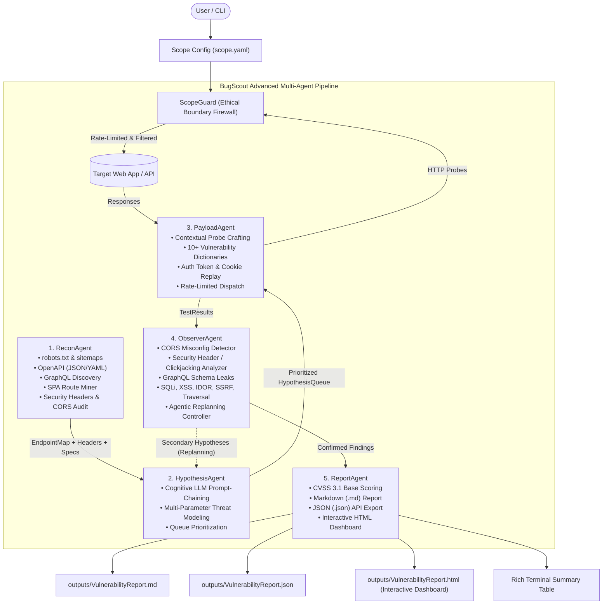

# 🛡️ BugScout — Autonomous Bug Bounty & Attack Surface Scout

> **An Advanced Agentic AI Security Platform that autonomously explores attack surfaces, formulates vulnerability hypotheses using LLM reasoning, executes safe non-destructive test probes, and produces structured CVSS-scored vulnerability reports & interactive HTML dashboards.**


---

## 📌 Executive Overview

Penetration testing and bug bounty recon are traditionally manual, labor-intensive workflows. Existing automated scanners (Burp Suite, Nikto) rely on rigid rule-based pattern matching, while chat-based LLM assistants lack autonomous execution loops.

**BugScout** bridges this gap as an **autonomous multi-agent system** with a tight feedback loop:
$$\text{Recon} \longrightarrow \text{Hypothesize} \longrightarrow \text{Test} \longrightarrow \text{Observe} \longrightarrow \text{Replan / Refine} \longrightarrow \text{Report}$$

All outbound requests are strictly governed by **ScopeGuard** — a cross-cutting ethical firewall that enforces target boundaries, prevents SSRF against internal/private infrastructure, rate limits traffic, and contains an automated kill-switch.

---

## 🤖 Advanced Multi-Agent Architecture



### Agent Roster & Responsibilities

| Agent | Responsibility | Core Capabilities |
|---|---|---|
| **ReconAgent** | Attack Surface Discovery | Parses `robots.txt`, `sitemap.xml`, OpenAPI/Swagger specifications, discovers GraphQL endpoints, extracts SPA client routes (React/Vue), audits security headers (`X-Frame-Options`, `CSP`), fingerprints tech stack headers. |
| **HypothesisAgent** | Threat Modeling & Prioritization | Cognitive LLM reasoning (Groq / Gemini) analyzing parameter semantics (`id`, `search`, `url`, `role`, `file`), correlates with 10+ OWASP risk vectors, ranks test queue. |
| **PayloadAgent** | Safe Probe Execution | Selects non-destructive probes (`payloads/*.txt`), contextually mutates query params, JSON bodies, and headers, replays session cookies, routes all requests through `ScopeGuard`. |
| **ObserverAgent** | Anomaly Detection & Replanning | Detects CORS misconfigurations, missing security headers / clickjacking exposure, GraphQL schema leaks, open redirects, path traversals, SQLi database error patterns, unescaped XSS reflections, and IDOR differentials. Triggers secondary feedback cycles. |
| **ReportAgent** | Intelligence Synthesis | Calculates CVSS 3.1 base scores & vector strings, generates step-by-step reproduction instructions, raw evidence snippets, remediation code, and outputs Markdown, JSON, and standalone **Interactive HTML Dashboards**. |
| **ScopeGuard** | Ethical Firewall & Safety Layer | Hard blocks out-of-scope hosts, path wildcards, private IP ranges (RFC 1918, link-local, cloud metadata `169.254.169.254`), enforces token-bucket rate limiting, and triggers a kill-switch on consecutive violations. |

---

## 🎯 Supported Vulnerability Classes (10+ Vectors)

1. **SQL Injection (SQLi)**: Error-based and time-based boolean anomaly detection across MySQL, SQLite, PostgreSQL, MSSQL, Oracle.
2. **Reflected Cross-Site Scripting (XSS)**: Unescaped HTML/DOM reflection marker tracking.
3. **CORS Misconfiguration**: Arbitrary untrusted origin reflection combined with `Access-Control-Allow-Credentials: true`.
4. **Missing Critical Security Headers / Clickjacking**: Missing `X-Frame-Options` and `Content-Security-Policy: frame-ancestors`.
5. **GraphQL Schema Introspection**: Disclosed `__schema` definitions leaking backend queries, types, and fields.
6. **Insecure Direct Object Reference (IDOR)**: Differential object identifier data exposure without session authorization.
7. **Open URL Redirection**: Unvalidated external domain redirection via HTTP 301/302 `Location` headers.
8. **Path / Directory Traversal**: Local file inclusion sequences targeting system configuration files.
9. **Exposed Environment & Secret Credentials**: Publicly accessible `.env`, API keys, database credentials, JWT secrets.
10. **Broken Authentication on Privileged Routes**: Administrative routes accessible without valid authentication tokens.

---

## ⚡ Zero-Cost LLM Engine

BugScout operates with **zero paid API dependencies**. The modular LLM engine (`core/llm.py`) supports:

1. **Groq Cloud API** (`GROQ_API_KEY`): Ultra-fast inference with `qwen/qwen3.8-27b`, `openai/gpt-oss-120b`, or `llama-3.3-70b-versatile`.
2. **Google Gemini Free Tier** (`GEMINI_API_KEY`): Generative reasoning via `gemini-2.5-flash`.
3. **Hugging Face Free Inference API** (`HF_TOKEN`): Serverless open-source models.
4. **Local Ollama** (`OLLAMA_HOST`): Run local models like `llama3` or `qwen2.5-coder`.
5. **Built-in Offline Security Intelligence Engine**: Deterministic OWASP correlation rules (100% offline, zero latency, zero setup).

---

## 🚀 Quickstart & Installation

### 1. Prerequisites & Virtual Environment Setup
Ensure you have Python 3.11+ installed.

```bash
# Clone the repository
git clone https://github.com/VedantPanchal23/BugScout.git
cd BugScout

# Create and activate Python 3.11 virtual environment
py -3.11 -m venv .venv

# On Windows PowerShell:
.\.venv\Scripts\Activate.ps1

# On Linux/macOS:
source .venv/bin/activate

# Install dependencies
pip install -r requirements.txt
```

### 2. Configure Environment (Optional for Cloud LLMs)
Create a `.env` file from `.env.example`:
```bash
GROQ_API_KEY=your_groq_key_here
```

### 3. Run Built-in Live Demo (One-Click)
BugScout includes a self-contained deliberately vulnerable test target (`mock_target/server.py`):

```bash
python main.py --demo
```

### 4. Run Against a Custom Authorized Target
1. Configure your target and allowed scope in `config/scope.yaml`:
   ```yaml
   target: "http://your-authorized-app.com"
   allowed_hosts:
     - "your-authorized-app.com"
   allowed_paths:
     - "/api/*"
     - "/search"
   max_requests_per_minute: 60
   ```
2. Execute the autonomous scout:
   ```bash
   python main.py --config config/scope.yaml
   ```

---

## 📊 Interactive HTML Dashboard

BugScout generates a standalone, modern interactive web dashboard (`outputs/VulnerabilityReport.html`):
- **Executive KPI Cards**: Summary count of Critical, High, Medium, Low findings and scan duration.
- **Visual Analytics**: Interactive Chart.js doughnut charts for severity distribution and vulnerability classes.
- **Search & Filter Controls**: Live filtering by severity level, search query, or affected endpoint.
- **Copyable PoCs**: One-click copyable `curl` commands and step-by-step reproduction instructions.
- **Developer Remediation**: Contextual code fixes and CWE references.

---

## 🧪 Testing & Verification

Run the comprehensive unit, edge-case, and integration test suite:

```bash
pytest -v
```

Test coverage includes:
- `tests/test_scope_guard.py`: Scope matching, path prefix wildcards, private IP blocks, metadata protection, payload validation, and kill-switch activation.
- `tests/test_recon.py`: Endpoint registration, sitemap/robots parsing, SPA client routing, and JavaScript regex endpoint extraction.
- `tests/test_observer.py`: CORS misconfig, missing headers, GraphQL introspection, Open Redirect, Path Traversal, SQLi, XSS, and credential leaks.
- `tests/test_llm.py`: Tests offline heuristic engine and live Groq LLM integration.
- `tests/test_full_pipeline.py`: End-to-end multi-agent execution against the mock target.

---

## ⚖️ Ethical & Legal Compliance

> [!CAUTION]
> **Authorized Testing Only:** BugScout is engineered strictly for authorized security assessments, CTF challenges, developer self-assessments, and bug bounty programs with explicit written scope authorization.

- **Non-Destructive Probes Only:** BugScout does not execute destructive queries (`DROP`, `DELETE`, `TRUNCATE`), denial-of-service payloads, or password spraying attacks.
- **SSRF Safeguard:** Outbound probes to internal IP ranges (`10.0.0.0/8`, `192.168.0.0/16`, `172.16.0.0/12`, `127.0.0.0/8`, `169.254.169.254`) are hard-blocked by default.
- **Scope Integrity:** Any request outside `allowed_hosts` or `allowed_paths` is intercepted before touching the network.
